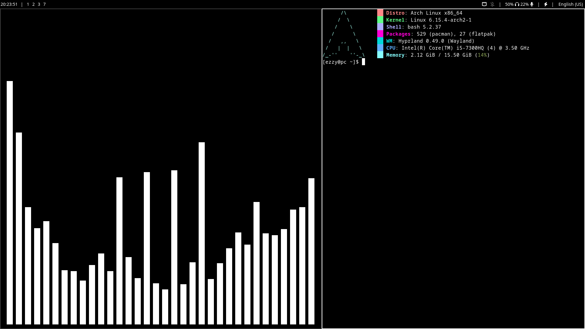
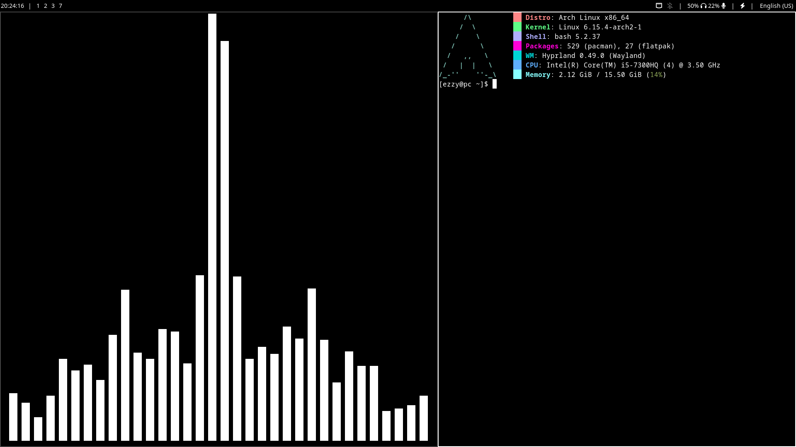
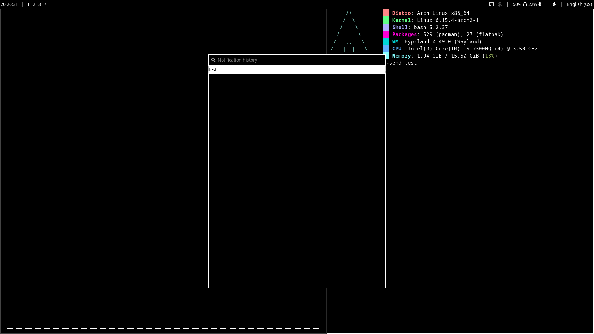

### 👋 Welcome!
This is my clean, minimalistic, dwm-like Hyprland dotfiles!
Used with `wofi`, `waybar`, `clipman` and `mako`

---

### 🖼️ Screenshots

---

### ⌨️ Binds
Alt+Shift = Switch input language

Super+Space = Toggle floating state of focused window

Super+Tab = Focus next window

Super+Shift+Tab = Focus previous window

Super+R = Open wofi drun

Super+V = Open Clipboard History menu

Super+N = Open Notification History menu

Super+T = Open preffered terminal

Super+B = Open preffered browser

Super+Enter = Swap focused window with master/stacked

Super+H = Resize focused window right by 25%

Super+L = Resize focused window left by 25%

Super+J = Resize focused window down by 25%

Super+K = Resize focused window up by 25%

Super+Left = Focus left window

Super+Right = Focus right window

Super+Down = Focus lower window

Super+Up = Focus higher window

---

### 🚨 Issues
#### Installation script
The installation script works **ONLY on Arch-like Distributions (like Artix, EndeavourOS, Manjaro)**

#### Waybar
If your laptop has a battery, you'll need to edit the waybar configuration and at `"custom/separator", "battery", `line, remove the '\*/' and '\/*'

---

### ➡️🖥️ How to install
`git clone https://github.com/ezzyqq/hyprdots $HOME/hyprdots && cd hyprdots && chmod a=rx INSTALL.sh && ./INSTALL.sh`
